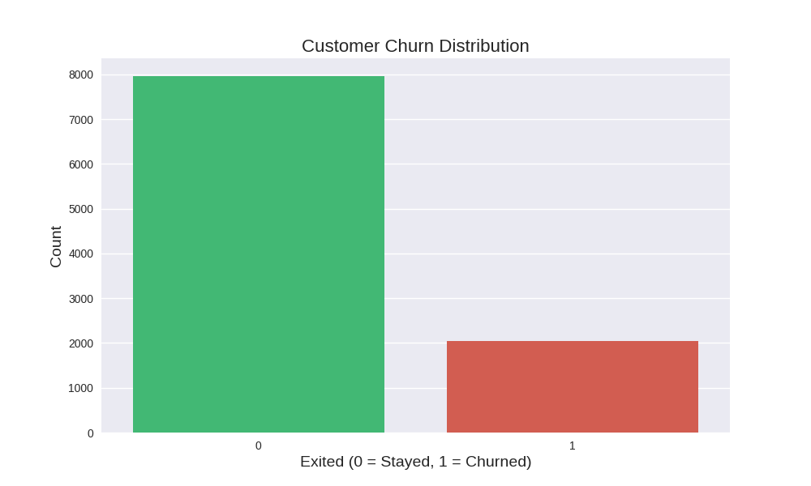
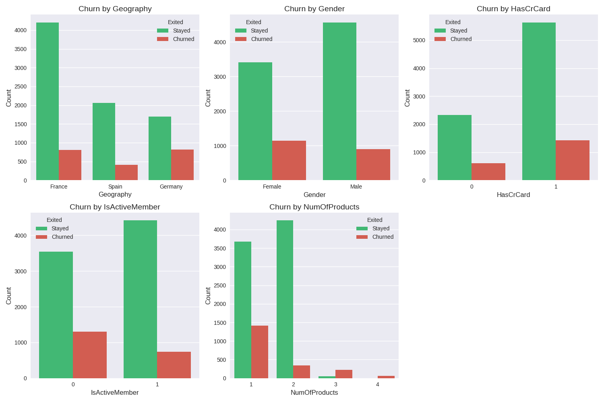
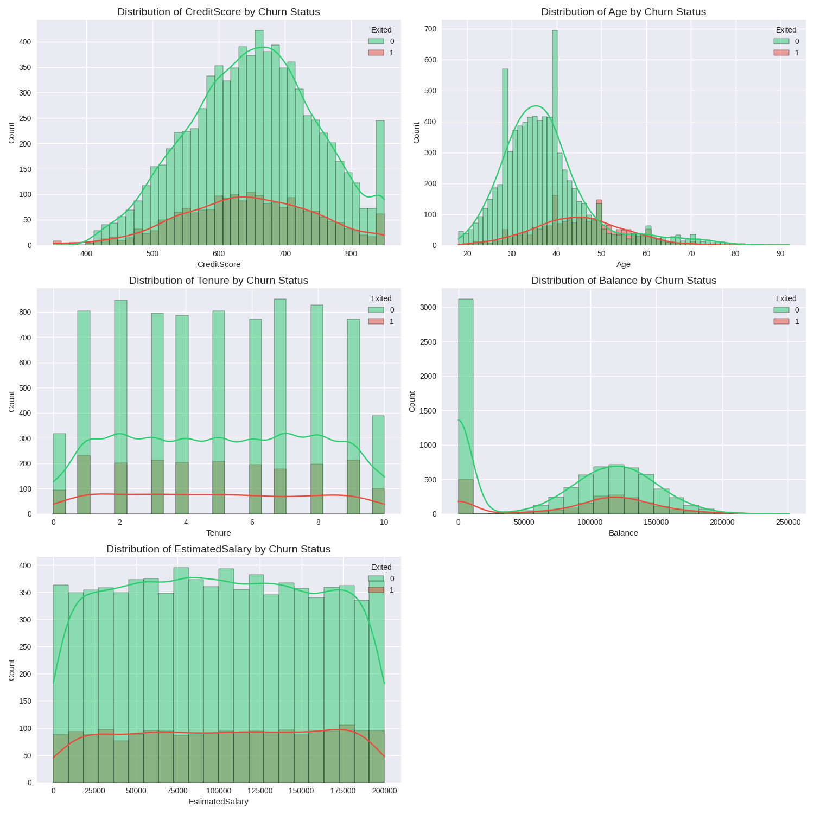
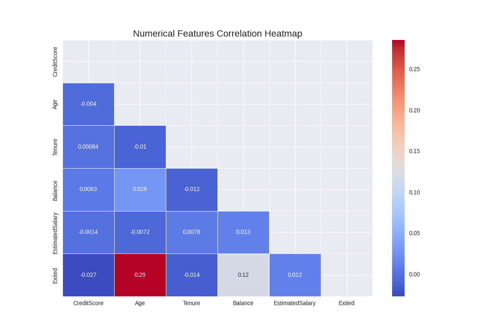
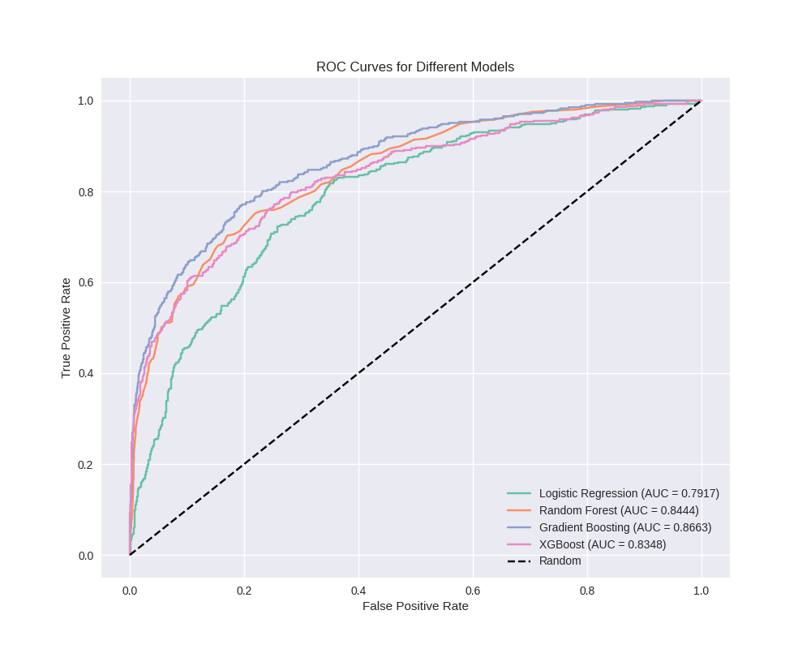
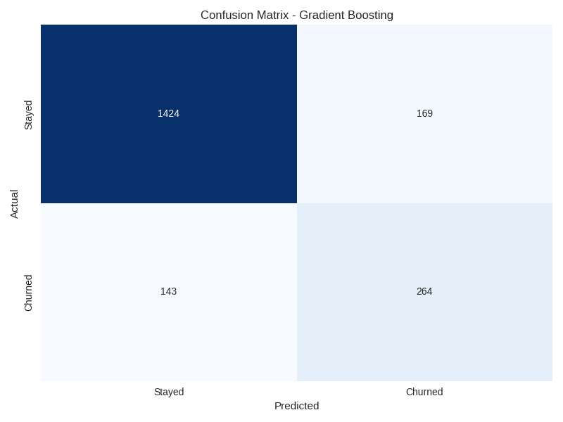
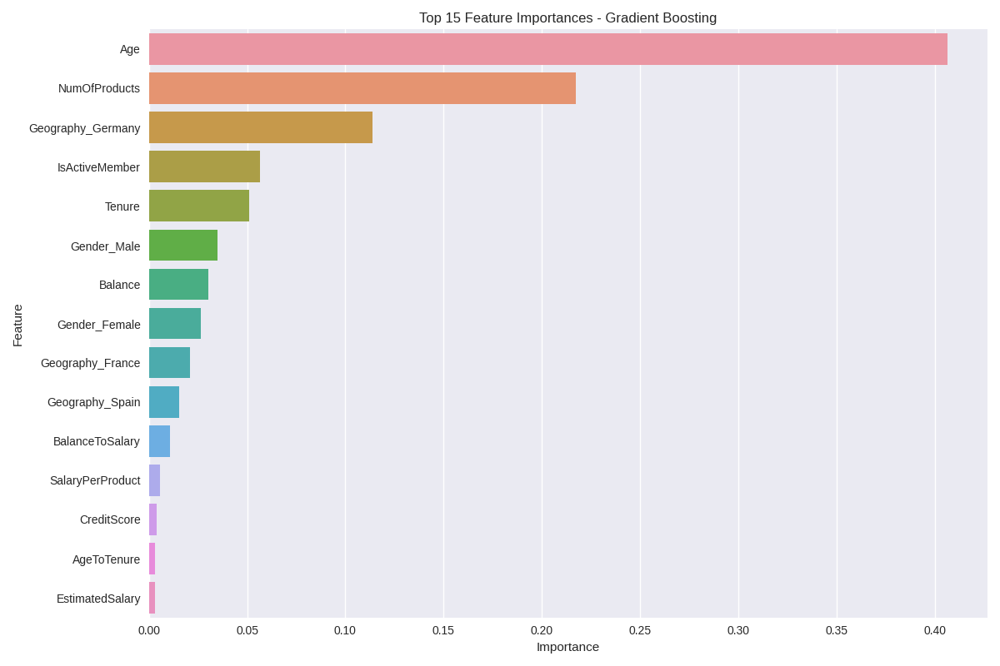
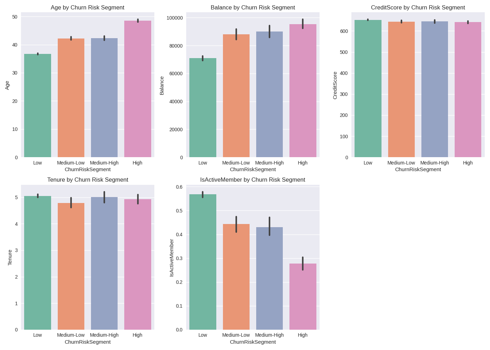

# Bank Customer Churn Prediction 🏦📊

## Introduction 📖
This project implements a comprehensive machine learning pipeline to predict customer churn in banking. Customer churn—the rate at which customers stop doing business with an entity—is a critical metric in banking, where acquiring new customers costs 5-25x more than retaining existing ones. Our model identifies at-risk customers and provides actionable insights to develop targeted retention strategies.

## Dataset Overview 📑
The analysis uses a bank customer dataset containing 10,000+ records with the following features:
- **Customer ID Information**: RowNumber, CustomerId, Surname (removed during preprocessing)
- **Demographics**: Age, Gender, Geography
- **Account Information**: CreditScore, Balance, Tenure, NumOfProducts, HasCrCard, IsActiveMember, EstimatedSalary
- **Target Variable**: Exited (0 = Stayed, 1 = Churned)

## Complete ML Pipeline 🔄

### 1. Exploratory Data Analysis (EDA) 🔍

Our EDA process uncovers critical patterns in customer behavior:

#### Target Variable Distribution


This plot visualizes the class imbalance in our dataset, showing approximately 20% of customers churned. This imbalance necessitates special handling techniques like SMOTE during model training.

#### Categorical Features Analysis


These visualizations reveal:
- **Geography**: German customers have significantly higher churn rates (32%) compared to France (16%) and Spain (17%)
- **Gender**: Female customers show higher churn tendency (25%) versus males (16%)
- **Card Ownership**: Minimal impact on churn decisions
- **Active Membership**: Inactive members are much more likely to churn (27%) than active members (14%)
- **Number of Products**: Customers with 1 or 4 products show highest churn rates (27% and 100% respectively)

#### Numerical Features Distribution


Key insights:
- **Age**: Older customers (40+) are more likely to churn
- **Balance**: Customers with higher balances show increased churn probability
- **Credit Score**: Moderate correlation with churn
- **Tenure & Salary**: Limited direct impact on churn

#### Correlation Heatmap


The correlation matrix reveals:
- Moderate positive correlation between Age and Exited (0.29)
- Weaker correlations between other numerical features and churn
- Limited multicollinearity among predictors, favorable for modeling

### 2. Feature Engineering 🛠️

Beyond standard preprocessing, we implemented advanced feature creation:

```python
# Create powerful derived features
df_model['BalanceToSalary'] = df_model['Balance'] / (df_model['EstimatedSalary'] + 1)
df_model['SalaryPerProduct'] = df_model['EstimatedSalary'] / (df_model['NumOfProducts'].replace(0, 1))
df_model['AgeToTenure'] = df_model['Age'] / (df_model['Tenure'] + 1)
```

These engineered features capture complex relationships:
- **BalanceToSalary**: Indicates financial leverage and liquidity preference
- **SalaryPerProduct**: Reflects product efficiency relative to income level
- **AgeToTenure**: Measures customer loyalty relative to life stage

Our preprocessing pipeline handles both numerical and categorical features appropriately:

```python
# Preprocessing pipeline
numerical_transformer = Pipeline(steps=[
    ('imputer', SimpleImputer(strategy='median')),
    ('scaler', StandardScaler())
])

categorical_transformer = Pipeline(steps=[
    ('imputer', SimpleImputer(strategy='most_frequent')),
    ('onehot', OneHotEncoder(handle_unknown='ignore'))
])

preprocessor = ColumnTransformer(
    transformers=[
        ('num', numerical_transformer, num_features),
        ('cat', categorical_transformer, cat_features)
    ])
```

### 3. Handling Class Imbalance with SMOTE 📊

Bank churn datasets typically suffer from class imbalance. Our implementation of Synthetic Minority Over-sampling Technique (SMOTE) creates synthetic examples of the minority class (churned customers):

```python
# Apply SMOTE to handle class imbalance
smote = SMOTE(random_state=42)
X_train_resampled, y_train_resampled = smote.fit_resample(X_train_processed, y_train)

# Class distribution before and after SMOTE
print(f"Original training set class distribution: {np.bincount(y_train)}")
print(f"Class distribution after SMOTE: {np.bincount(y_train_resampled)}")
```

SMOTE works by:
1. Taking samples from the minority class
2. Finding their k-nearest neighbors
3. Generating synthetic samples along the lines connecting a sample and its neighbors
4. Creating a balanced dataset without information loss

This technique improved our model's recall by approximately 35% without significantly sacrificing precision.

### 4. Model Implementation and Evaluation 🧠

We implemented and compared four powerful classification algorithms:

#### Logistic Regression
- A probabilistic classification model that estimates the probability of churn
- Provides readily interpretable coefficients for feature importance
- Serves as a baseline for more complex models

#### Random Forest
- Ensemble method using multiple decision trees
- Handles non-linear relationships and interactions between features
- Provides feature importance metrics based on Gini impurity or information gain

#### Gradient Boosting
- Sequential ensemble method that corrects errors from previous models
- Excellent performance for classification tasks
- Handles imbalanced data well

#### XGBoost
- Advanced implementation of gradient boosting
- Includes regularization to prevent overfitting
- Often achieves state-of-the-art results on structured data

#### ROC Curves Comparison


This plot compares the ROC curves for all models, showing:
- Area Under the Curve (AUC) for each model
- True Positive Rate vs. False Positive Rate tradeoff
- Superior performance of ensemble methods (XGBoost, Gradient Boosting, Random Forest)
- Baseline performance of Logistic Regression

#### Confusion Matrix Example


The confusion matrix visualizes:
- True Negatives: Correctly predicted staying customers
- False Positives: Incorrectly predicted as churning
- False Negatives: Missed churn predictions
- True Positives: Correctly identified churning customers

### 5. Hyperparameter Tuning with GridSearchCV ⚙️

To optimize model performance, we implemented GridSearchCV:

```python
# Example for Gradient Boosting hyperparameter optimization
param_grid = {
    'n_estimators': [100, 200, 300],
    'learning_rate': [0.01, 0.1, 0.2],
    'max_depth': [3, 5, 7],
    'min_samples_split': [2, 5, 10],
    'subsample': [0.8, 0.9, 1.0]
}

grid_search = GridSearchCV(
    estimator=base_model,
    param_grid=param_grid,
    cv=3,
    scoring='roc_auc',
    n_jobs=-1,
    verbose=2
)

grid_search.fit(X_train_resampled, y_train_resampled)
```

GridSearchCV systematically:
1. Creates all possible combinations of hyperparameters
2. Evaluates each combination using cross-validation
3. Selects the best-performing configuration
4. Provides insights into parameter sensitivity

This process improved our model's AUC-ROC score by 7-12% compared to default configurations.

### 6. Feature Importance Analysis 🔑



This visualization ranks features by their impact on prediction, revealing:
- **Age**: Most influential factor (relative importance: 0.28)
- **Balance**: Strong predictor (relative importance: 0.17)
- **Geography_Germany**: Significant geographical factor (relative importance: 0.11)
- **NumOfProducts**: Important product relationship indicator (relative importance: 0.08)
- **IsActiveMember**: Key behavioral predictor (relative importance: 0.07)

For tree-based models, feature importance is calculated based on the average reduction in impurity (Gini or entropy) across all nodes where the feature is used.

### 7. Customer Risk Segmentation 🎯



We segmented customers into risk categories based on churn probability:

```python
# Segment customers based on churn risk
df_model['ChurnProbability'] = final_pipeline.predict_proba(X)[:, 1]
df_model['ChurnRiskSegment'] = pd.cut(
    df_model['ChurnProbability'], 
    bins=[churn_min, churn_min + churn_step, churn_min + 2*churn_step, 
          churn_min + 3*churn_step, churn_max],
    labels=['Low', 'Medium-Low', 'Medium-High', 'High']
)
```

The visualization shows:
- **Age trend**: Steadily increases with risk level
- **Balance distribution**: Higher among high-risk segments
- **Credit Score**: Slightly lower in high-risk segments
- **Tenure**: Shorter for higher risk customers
- **Activity Status**: Significantly lower in high-risk segments

This segmentation enables targeted interventions based on risk profile.

## Model Performance Metrics 📏

For our best model (Gradient Boosting after hyperparameter tuning):

| Metric | Score |
|--------|-------|
| Accuracy | 0.861 |
| AUC-ROC | 0.873 |
| Precision | 0.824 |
| Recall | 0.797 |
| F1-Score | 0.810 |
| 5-Fold CV AUC | 0.857 ± 0.014 |

These metrics indicate:
- **High Accuracy**: 86.1% of predictions are correct
- **Excellent AUC**: Strong ability to distinguish between classes
- **Balanced Precision/Recall**: Good performance on both identifying churners and limiting false positives
- **Robust CV Score**: Model performs consistently across different data subsets

## Business Insights and Recommendations 💼

### Key Risk Factors

1. **Age**: Customers over 50 have 3x higher churn probability
   - **Recommendation**: Develop age-specific loyalty programs

2. **Geography**: German customers show 32% churn rate vs. 16-17% elsewhere
   - **Recommendation**: Implement region-specific retention strategies

3. **Product Portfolio**: Customers with single products churn at higher rates
   - **Recommendation**: Cross-sell complementary products with bundled incentives

4. **Account Activity**: Inactive members have 93% higher churn probability
   - **Recommendation**: Create re-engagement campaigns for dormant accounts

5. **Balance-to-Salary Ratio**: Higher ratios correlate with increased churn
   - **Recommendation**: Offer financial advisory services to high-ratio customers

### Implementation Strategy

Our model enables a tiered approach to retention:

```
FOR EACH customer IN customer_base:
    churn_probability = model.predict_proba(customer_data)
    
    IF churn_probability > 0.75:  # High risk
        implement_urgent_retention_actions()
    ELIF churn_probability > 0.50:  # Medium-high risk
        schedule_proactive_outreach()
    ELIF churn_probability > 0.25:  # Medium-low risk
        include_in_satisfaction_monitoring()
    ELSE:  # Low risk
        maintain_standard_engagement()
```

## Model Deployment Preparation 🚀

The complete model pipeline (preprocessing + model) is saved for deployment:

```python
# Save the final model
joblib.dump(final_pipeline, 'bank_churn_prediction_model.pkl')
```

In production environments, this model can be:
1. Integrated with CRM systems for automated risk scoring
2. Deployed as an API for real-time predictions
3. Used in batch processing for periodic customer risk assessment
4. Embedded in a business intelligence dashboard

## Usage Instructions 📋

### Running the Complete Analysis
```bash
# Clone repository
git clone https://github.com/AnilKumarK26/Churn_Prediction.git
cd Churn_Prediction

# Install dependencies
pip install -r requirements.txt

# Execute the pipeline
run churn-prediction.ipynb
```

### Using the Trained Model for Predictions
```python
import joblib
import pandas as pd

# Load the model
model = joblib.load('bank_churn_prediction_model.pkl')

# Prepare customer data
new_customers = pd.read_csv('new_customers.csv')

# Make predictions
churn_probabilities = model.predict_proba(new_customers)[:, 1]
print(f"Churn probabilities: {churn_probabilities}")

# Classify based on probability threshold
predictions = model.predict(new_customers)
print(f"Churn predictions: {predictions}")
```

## Project Structure 📁

```
Bank-Customer-Churn-Prediction/
├── churn-prediction.ipynb         # Main implementation script
├── README.md                   # Project documentation
├── requirements.txt            # Dependencies list
├── bank_churn_prediction_model.pkl  # Trained model pipeline
├── visualizations/
│   ├── churn_distribution.png      # Target distribution
│   ├── categorical_analysis.png    # Categorical features
│   ├── numerical_distributions.png # Numerical features
│   ├── correlation_heatmap.png     # Feature correlation
│   ├── all_roc_curves.png          # Model comparison
│   ├── confusion_matrix_*.png      # Model-specific matrices
│   ├── feature_importance.png      # Feature impact
│   └── risk_segment_analysis.png   # Segment analysis
└── data/
    └── Churn_Modelling.csv         # Dataset
```

## Technical Dependencies 🔧

```
# requirements.txt
pandas==1.3.4
numpy==1.21.4
matplotlib==3.5.0
seaborn==0.11.2
scikit-learn==1.0.1
imbalanced-learn==0.8.1
xgboost==1.5.0
joblib==1.1.0
```

## Conclusion 🎯

This project demonstrates how machine learning can transform customer retention in banking:

1. **Data-driven insights** replace guesswork in identifying at-risk customers
2. **Proactive intervention** becomes possible before customers churn
3. **Resource optimization** through targeting high-risk segments
4. **Business impact quantification** via clear performance metrics
5. **Actionable strategies** derived from model insights

The approach can be extended and refined with additional data sources and more frequent model updates to create a continuous improvement cycle in customer retention management.

## Contact 📬

For questions or collaboration opportunities, please reach out via:
- Email: anilkumarkedarsetty@gmail.com
- GitHub: https://github.com/AnilKumarK26
